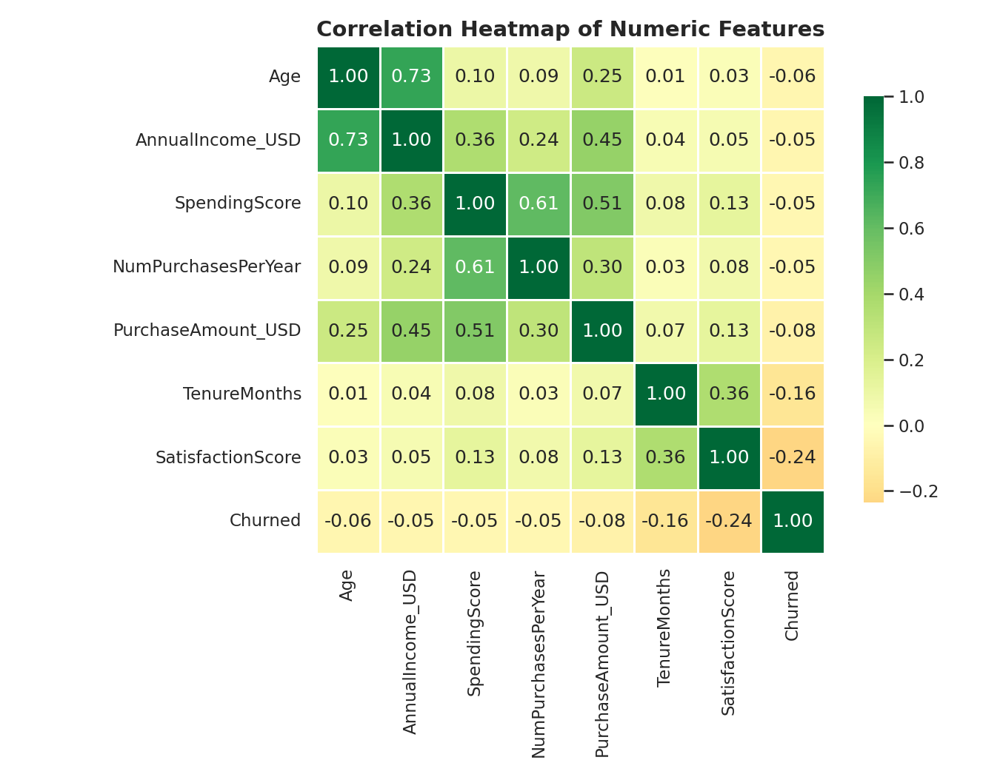
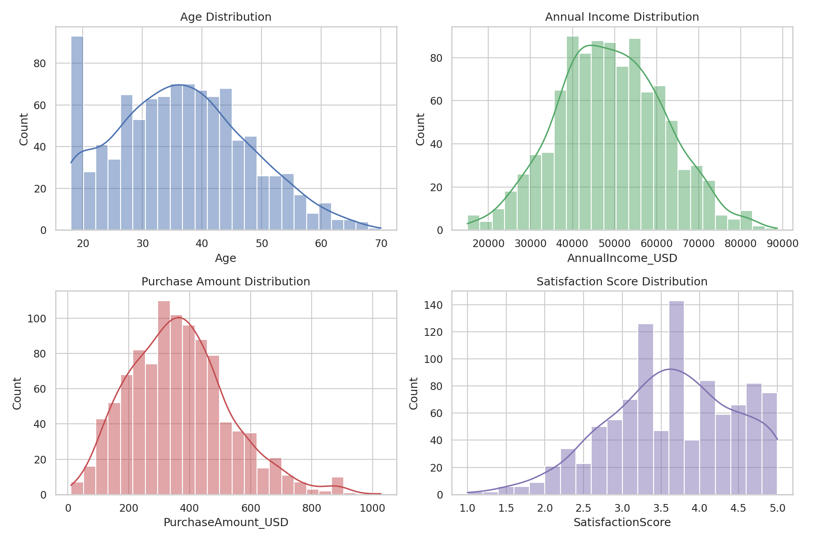
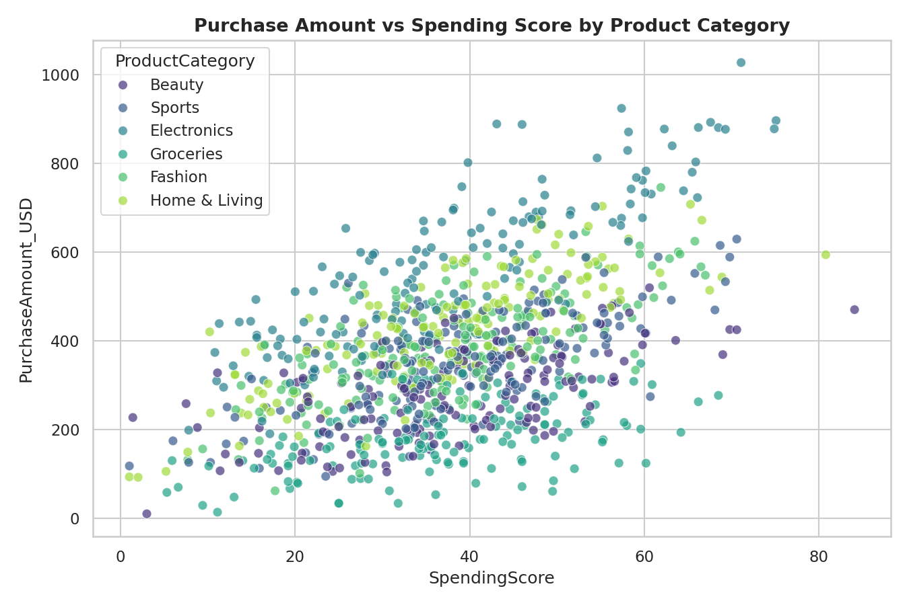
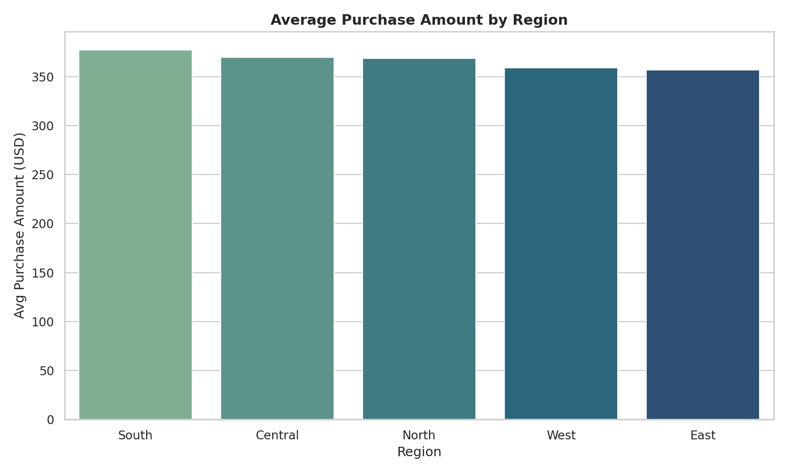
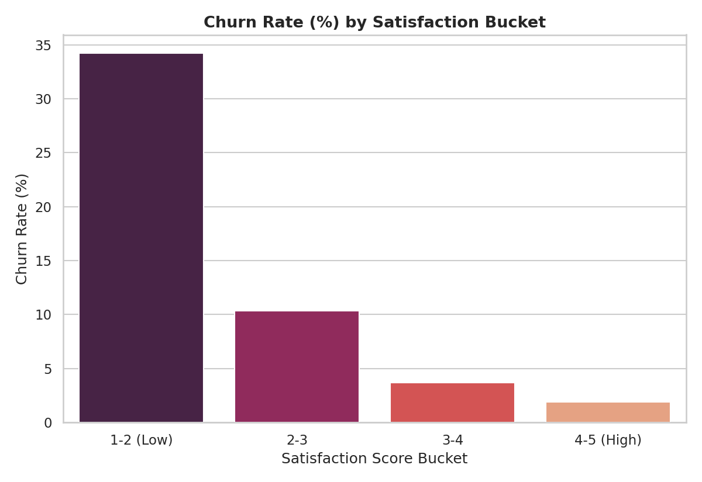
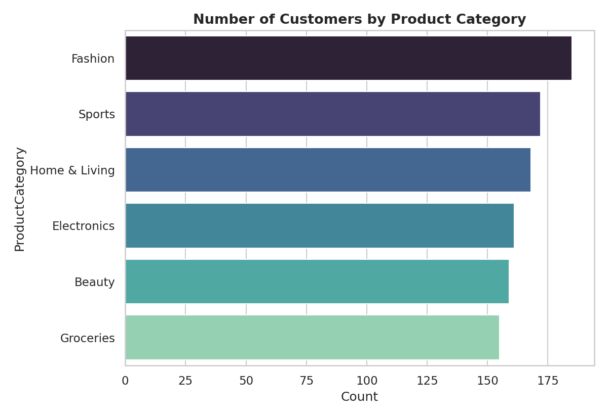
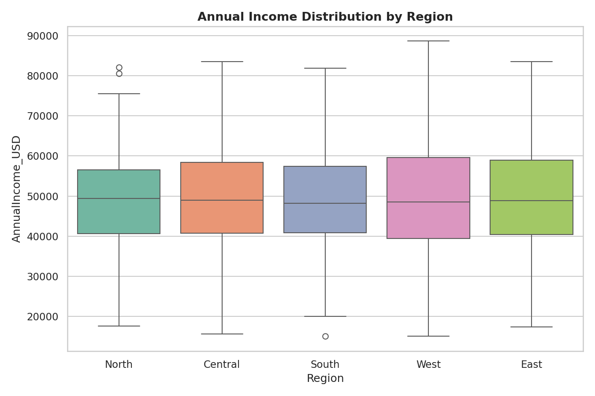

# 📊 Exploratory Data Analysis (EDA) Project
### E-Commerce Customer Behavior Analysis

> Analyze a dataset to uncover patterns and trends — using statistical summaries, visualizations, correlation analysis, and a structured report of key influencing factors.

---

## 1. Project Overview

| Field | Detail |
|---|---|
| **Project Title** | Exploratory Data Analysis (EDA) Project |
| **Dataset** | E-Commerce Customer Behavior (synthetic, 1,000 records) |
| **Rows × Columns** | 1,000 × 12 |
| **Domain** | Retail / E-Commerce |
| **Tools Used** | Python, Pandas, NumPy, Matplotlib, Seaborn |
| **Goal** | Uncover patterns/trends, identify correlations & key influencing factors, present insights in a structured report |

---

## 2. Dataset Description

| Column | Type | Description |
|---|---|---|
| `CustomerID` | String | Unique customer identifier |
| `Age` | Integer | Customer age (18–70) |
| `Gender` | Categorical | Male / Female / Other |
| `Region` | Categorical | North / South / East / West / Central |
| `AnnualIncome_USD` | Numeric | Annual income in USD |
| `SpendingScore` | Numeric | Score (1–100) assigned based on spending behavior |
| `ProductCategory` | Categorical | Primary product category purchased |
| `NumPurchasesPerYear` | Integer | Number of purchases made per year |
| `PurchaseAmount_USD` | Numeric | Average purchase amount in USD |
| `TenureMonths` | Integer | Months since the customer joined |
| `SatisfactionScore` | Numeric | Customer satisfaction rating (1–5) |
| `Churned` | Binary | 1 = customer churned, 0 = retained |

Raw data: [`data/ecommerce_customer_data.csv`](data/ecommerce_customer_data.csv)
Full statistical summary: [`data/summary_statistics.csv`](data/summary_statistics.csv)

---

## 3. Key Statistical Summary

| Metric | Age | Annual Income (USD) | Spending Score | Purchase Amount (USD) | Satisfaction Score |
|---|---|---|---|---|---|
| Mean | 36.5 | 49,168 | 37.8 | 366.7 | 3.63 |
| Std Dev | 11.2 | 12,785 | 13.8 | 165.7 | 0.83 |
| Min | 18 | 15,000 | 1.0 | 10.0 | 1.0 |
| 25% | 28 | 40,500 | 28.9 | 247.2 | 3.1 |
| Median (50%) | 36 | 48,900 | 37.5 | 359.8 | 3.7 |
| 75% | 44 | 57,900 | 47.0 | 463.2 | 4.2 |
| Max | 70 | 88,700 | 84.1 | 1,027.6 | 5.0 |

---

## 4. Methodology

1. **Data Understanding** — inspected shape, dtypes, null values, and duplicates.
2. **Statistical Summary** — computed descriptive statistics (mean, median, std, quartiles) for all numeric fields.
3. **Univariate Analysis** — examined distributions of Age, Income, Purchase Amount, and Satisfaction.
4. **Bivariate & Correlation Analysis** — correlation matrix + scatter plots to identify influencing factors.
5. **Segment Analysis** — grouped by Region, Product Category, and Satisfaction Bucket to compare behavior.
6. **Insight Reporting** — consolidated findings into the structured report below.

---

## 5. Visualizations

### 5.1 Correlation Heatmap
Shows how numeric features relate to each other — income and spending score are the strongest positive drivers of purchase amount, while satisfaction is negatively correlated with churn.



### 5.2 Distribution of Key Variables
Age, Income, Purchase Amount, and Satisfaction Score all follow roughly normal/right-skewed distributions typical of retail customer data.



### 5.3 Purchase Amount vs Spending Score (by Category)
Purchase amount rises with spending score across all categories, with **Electronics** customers spending noticeably more per transaction.



### 5.4 Average Purchase Amount by Region
The **South** region leads in average purchase value, followed closely by West and North.



### 5.5 Churn Rate by Satisfaction Bucket
Churn risk drops sharply as satisfaction increases — customers rating satisfaction 1–2 churn at **34.2%**, versus just **1.9%** for those rating 4–5.



### 5.6 Product Category Popularity
**Fashion** is the most purchased category (185 customers), followed by Electronics and Home & Living.



### 5.7 Income Distribution by Region
Income spread is broadly similar across regions, with slightly higher medians in the South and West.



---

## 6. Key Insights & Influencing Factors

| # | Insight | Supporting Metric |
|---|---|---|
| 1 | Spending Score is the strongest driver of Purchase Amount | Correlation = **0.51** |
| 2 | Annual Income moderately drives Purchase Amount | Correlation = **0.45** |
| 3 | Satisfaction is negatively correlated with Churn | Correlation = **-0.24** |
| 4 | Low-satisfaction customers churn ~18× more than high-satisfaction customers | 34.2% vs 1.9% churn rate |
| 5 | South region generates the highest average purchase value | $377.63 avg |
| 6 | Fashion is the most popular product category | 185 of 1,000 customers |
| 7 | Overall churn rate is relatively low | 5.6% |
| 8 | Age and Income are strongly related (career growth effect) | Correlation = **0.73** |

---

## 7. Expected Outcome

This project develops **analytical thinking and data exploration skills** by:
- Applying statistical summaries and visualizations to raw data
- Identifying correlations and key factors influencing customer behavior
- Communicating findings clearly through a structured, visual report

---

## 8. Project Structure

```
eda_project/
├── README.md                          # This report
├── requirements.txt                   # Python dependencies
├── data/
│   ├── ecommerce_customer_data.csv    # Raw dataset (1,000 rows)
│   ├── summary_statistics.csv         # Full describe() output
│   └── key_insights.csv               # Extracted key metrics
├── notebooks/
│   ├── 01_generate_data.py            # Dataset generation script
│   └── 02_eda_analysis.py             # Full EDA + chart generation
└── images/
    ├── 01_correlation_heatmap.png
    ├── 02_distributions.png
    ├── 03_spending_vs_purchase.png
    ├── 04_avg_purchase_by_region.png
    ├── 05_churn_by_satisfaction.png
    ├── 06_category_popularity.png
    └── 07_income_by_region_box.png
```

---

## 9. How to Run

```bash
pip install -r requirements.txt
python notebooks/01_generate_data.py     # generates the dataset
python notebooks/02_eda_analysis.py      # runs EDA and saves charts
```

---

## 10. Conclusion

The analysis shows customer spending behavior is primarily driven by **spending score and income**, while **satisfaction is the key lever for retention** — low-satisfaction customers are far more likely to churn. Targeting the **South region** and the **Fashion/Electronics** categories with satisfaction-focused retention campaigns is the clearest opportunity for revenue growth.
